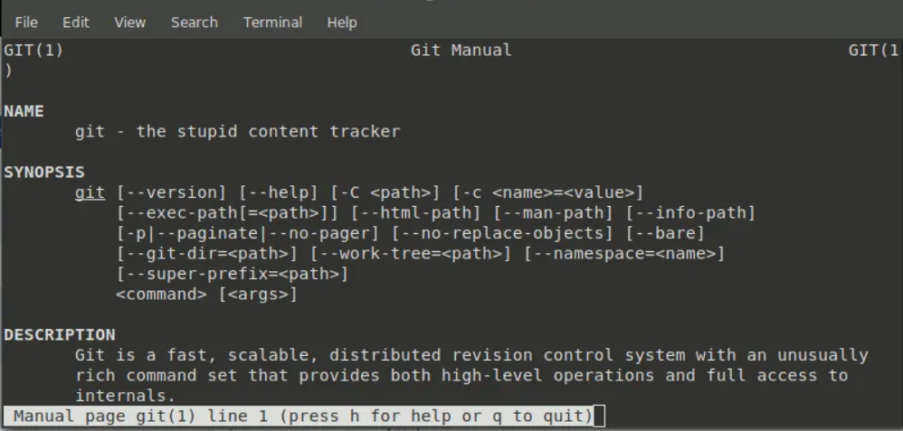

# Introduction to Java and Development Tools

## Objectives

- Get to know each other
- Impro games
- Review the used applications
- Evaluate coding skills (Moodle)
- Get to know the development tools (IDEA, git)
- Introduce Java SE: Strings, arrays, methods, exception handling
- Practice GitHub basics (fork, clone, commit/push)
- Debugging, refactoring, clean code
- Practice pair-programming, TDD and JUnit

## Main Content

**Preferably, to avoid the over-burden of our network, please use the provided installations executables from the USB sticks!**

### Preparation: Setting up Discord and Chrome

1. Install Discord Desktop App
   
    - Linux: 
      - From .deb files you may install easily by executing the file
    - Make sure, to check your E-mail address, and accept our invitation to the courses [Discord](https://discordapp.com/download ) server.
    
    
2. Install Chrome 
    - Linux:
      
      - Installing from the provided archive:
        - From .deb files you may install easily by executing the file
      - Open a terminal and enter these commands:  
      
      ```wget https://dl.google.com/linux/direct/google-chrome-stable_current_amd64.deb
      sudo dpkg -i google-chrome-stable_current_amd64.deb
      ```
      - [Reference](https://linuxize.com/post/how-to-install-google-chrome-web-browser-on-ubuntu-18-04/)
      
    - [Link for Windows](https://www.google.com/chrome/browser/desktop/)

    - [Link for Mac](https://www.google.com/chrome/)

> ### &#128161; Note: Using Discord
> 
>  Using channels: 
>    - '#important-announcement' : Most important things, that you must know, only PM admins can write here
>    - '#coding' : everything that relates to exercises, solutions, tips&tricks
>    - '#general' : main communication from Progmasters, any course related info.
>    - '#questions' : all questions related to the course material
>    - '#random' : anything else, e.g.: where to go to have lunch, funny things, etc.
>    - '#complaints ' : delays, missing days, info for the mentors


### Preparation: Installing JDK

- Linux
  
  - **We are going to use OpenJDK!**
    
  - Installing from the provided archive:
    
    ````
    tar xvzf filename.tar.gz
    cd extracted_folder
    ./configure
    make
    make install
    make clean //Deletes temporary install files - Optional
    ````
    
    
    
  - Installing from APT Repository:
  
    - Open a terminal and enter these commands:  
  
    ```bash
    sudo apt install default-jdk
    ```
  
  - [Reference](https://www.digitalocean.com/community/tutorials/how-to-install-java-with-apt-on-ubuntu-18-04)
  
  - The latest JDK releases doesn't contain the sources and documentation. To install this enter the following command:  
  
    ````bash
    sudo apt install openjdk-11-source
    ````
  
  - Then in IDEA, you need to go to Project Structure (Ctrl + Alt + Shift + S) -> Platform Settings\SDKs -> Sourcpath -> ' + ' -> and select '/usr/lib/jvm/openjdk-11/src.zip'
  
- Windows
  - [Download OpenJDK 11 (MSI)](https://www.azul.com/downloads/zulu-community/?&version=java-11-lts&os=windows)
  - Run .msi file to install

- Mac
  - [Follow this link](https://www.azul.com/downloads/zulu-community/?&version=java-11-lts&os=macos)
  - Download the OpenJDK 11 installer (.DMG file)
  - [Setting environment variables on Mac](https://medium.com/@himanshuagarwal1395/setting-up-environment-variables-in-macos-sierra-f5978369b255) 

### Preparation: Setting up IDEA


- Install the **Community** version of [IntelliJ IDEA](https://www.jetbrains.com/idea/download/)
  (Later in the course we are going to use the **Ultimate** version, to which PROGmasters add you the license key.)
- Installing on Linux

  - From the provided archive
  
    ````
    tar xvzf filename.tar.gz
    cd extracted_folder
    ./configure
    make
    make install
    make clean //Deletes temporary install files - Optional
    ````

  - Under linux you may also use the following command
    ````
    sudo snap install intellij-idea-ultimate --classic
    ````
    

 - File/Settings ( Ctrl + Alt + S ): 
   - Build, Execution, Deployment -> Compiler -> Java compiler -> Project byte code version: 11  

### Exercise: PROGmasters exercises

- Prep test:  You can find the Assessment Test in Moodle: [Moodle](https://kepzes.progmasters.hu)
    - Note: You may login using your name as username: ````lastname_firstname````

### Training: Review test result

 - Mentor publish the results for everybody
 - interesting test topics:
    - 'import' basically just imports a namespace, so you don't have to use fully qualified names in the code. eg.: java.util.HashMap
    - why int[][10] is wrong? (memory handling for arrays)
    - difference between x++; ++x; and Why int a = x++; is bad practice?!
    - difference between object and class
    - terminolgy for instance variables: field == instance variable == property == attribute = member variable ~= object state

### Exercise:
- Work on Coding Challenges in [Moodle](https://kepzes.progmasters.hu)

<br><br>
1&#9602;&#9602;&#9602;&#9602;&#9602;&#9602;&#9602;&#9602;&#9602;&#9602;&#9602;&#9602;&#9602;&#9602;&#9602;&#9602;&#9602;&#9602;&#9602;&#9602;&#9602;&#9602;&#9602;&#9602;&#9602;&#9602;&#9602;&#9602;&#9602;&#9602;&#9602;&#9602;&#9602;&#9602;&#9602;&#9602;&#9602;&#9602;&#9602;2
<br><br>

### Hobby projects
 Start working on a hobby project, because it really matters on job interview what effort you have made outside of the course.

 [Ideas here](https://github.com/vicky002/1000_Projects)

### Hands-on: Command Line Tools

Watch how to use command line and PATH environment variable in Hunarian from "Sanfranciscobol Jottem" Youtube channel: [here](https://www.youtube.com/watch?v=GkEBDmCXiwA&list=PLyriihBWoulz2Eb3-FvL5bPXSQ-8poCNm)

(Optional) Learn Linux command line commands from [here](https://www.codecademy.com/learn/learn-the-command-line).

1. Open a text editor on your machine and create a simple class, call it HelloWorld.java
2. Save the file and make sure that the name of your class is the same as the filename (e.g. HelloWorld.java file contains a public class called HelloWord)
3. Open a command prompt/terminal on your machine
4. Check whether the java executable is available on your path (meaning if you open a terminal you can run the command 'java')
 - if not, then please set the PATH variable using [this description](https://docs.oracle.com/javase/tutorial/essential/environment/paths.html)
5. In the terminal window type:  
```javac HelloWorld.java```
 - it will turn your code into bytecode that can be executed now by the JVM (Java Virtual Machine)
6. Run the code with the following command:  
```java HelloWorld```
7. Before we go on with the next exercise, please [read this tutorial](https://docs.oracle.com/javase/tutorial/deployment/jar/basicsindex.html)
   (optionally [read the full tutorial](https://docs.oracle.com/javase/tutorial/deployment/jar/))

### Optional: Creating and running JAR files

8. Create a JAR file with this command:   
```jar cf hello.jar HelloWorld.class```  
and then try to run the application packaged as a JAR file:  
```java -jar hello.jar```  
Most probably it won't run, you'll get a 'no main manifest attribute...' message, which means the JAR file
itself doesn't know which class it should run/execute.
9. Let's try to set the application's entry point! For that you'll need to modify the default manifest file, which can be found
in the jar file under META-INF/MANIFEST.MF.  
You can do it manually, by editing the manifest file and adding a Main-Class: HelloWorld.class line at the end, 
or use this command:  
```jar ufe hello.jar HelloWorld```
10. Try to run the jar file again (now with the main class set in the manifest):  
```java -jar hello.jar```

> ### &#128161; Note: Important IDEA Hotkeys and Basic Refactoring
>
> Rewrite the HelloWorld class in IDEA and try out the following features.
>
> Auto import - Alt + Enter
> Code completion - Ctrl + Space
> Documentation lookup - Ctrl + Q 
>
> Possible options - Ctrl + Space
>
> Required method parameters - Ctrl + P
>
> Reformat code - Ctrl + Alt + L
> Delete line - Ctrl + Y
> Duplicate line - Ctrl + D
>
> Select region/Expand selection - Ctrl + W 
>
> ​						/Shrink selection - Ctrl + Shift + W
>
> Find - Ctrl + F
>
> Find and Replace - Ctrl + R 
>
> Find in path - Ctrl + Shift + F 
>
> Go to class - Ctrl + N
> Go to file - Ctrl + Shift + N
>
> Rename - Shift + F6
> Generate source (e.g. Constructor) - Alt + Insert
>
> Comment lines: Ctrl + Shift + / &#128161; on Linux you have to assign other hotkey in Preferences/Keymap)


<br><br>
2&#9602;&#9602;&#9602;&#9602;&#9602;&#9602;&#9602;&#9602;&#9602;&#9602;&#9602;&#9602;&#9602;&#9602;&#9602;&#9602;&#9602;&#9602;&#9602;&#9602;&#9602;&#9602;&#9602;&#9602;&#9602;&#9602;&#9602;&#9602;&#9602;&#9602;&#9602;&#9602;&#9602;&#9602;&#9602;&#9602;&#9602;&#9602;&#9602;3
<br><br>

### Training: Java basics

- [SoloLearn](https://www.sololearn.com/) (learn and practice): Download SoloLearn mobile application and challange each other!
- [Enki](https://www.enki.com/) (learn): Alternative mobil app for learning 
- Official [Oracle Java Tutorial](https://docs.oracle.com/javase/tutorial/) (learn)
- [W3Schools](https://www.w3schools.com/java/default.asp) (learn)
- [JavaTPoint](https://www.javatpoint.com/) (learn)
- [Tutorials Point](https://www.tutorialspoint.com/java/index.htm) (learn)
- JAVA SE basics [BME slides](https://my.pcloud.com/publink/show?code=kZJsHkkZFCM4TkUDSqYUDCYtBg4tpmdjo43k)

### Oracle official books and mock exams: Check your knowledge! 

 - [Drive link](https://drive.google.com/open?id=1-CLqfe53hx8VyC-42Lzw8gDy8KlrLHNM)
   - OCA Java SE 8 Programmer I Study Guide Exam 1Z0-808 - Hint: Review questions at the end of chapters
   - OCP Java SE 8 Programmer II - Study Guide (1Z0-809) - Advanced topics
   - Mock exams x 2

- [OCPJP Oracle Java exams](https://my.pcloud.com/publink/show?code=XZDGbkkZDnFqGboisdF203gDbUoc5mUnF4FX)

### Preparation: Using Git and GitHub

#### What is Git?

Git is a Distributed Revision Control System. But if we think about it, it's just a stupid content tracker. (Just check it's manual page, under linux:  `man git` )



Which means, it's main purpose it, to keep track of content (our code, in this case) by also keeping track of any changes, updates etc. and it does it, by simply storing all these changes as key-value pairs on our file system.

First of all, install command line [git client](https://www.atlassian.com/git/tutorials/install-git) to your computer (IDEA needs this).

OR

- Linux:
```sudo apt install git```
- [Windows](https://git-scm.com/download/win)
- [Mac](https://git-scm.com/download/mac)

Then set the path to the executable in IDEA->File->Settings->VersionControl->Git
(In Linux, git will be already in your PATH variable, in windows, you have to
use absolute path)

Repository (aka repo) is like a folder with subfolders and files.
The changes are tracked and version controlled by GIT.

For the exercises **clone** **01-java_intro** repository from your actual PM course Organisation on GitHub.

What does **clone** mean? A clone is another copy but with significant differences
from a fork. First, a clone is created on your machine, not on GitHub.
Secondly, a clone is supposed to kept in sync with the original repository.
It is actually your working copy of the project, in which you make your own
changes that will be pushed back to the original repo. Also, you can
periodically update this working copy by pulling recent updates from the
original repo that other developers have made since you cloned.

How? 

There are multiple approaches to do it:

- In IDEA (which support git):
    - [How to set up your GitHub account to IntelliJ](https://www.jetbrains.com/help/idea/github.html#register-account)
    - Then in IDEA: File-> New-> New Project From existing sources


  To figure out what to do, if IDEA doesn't recognise the Java project check the
  Troubleshooting section.
  
- With the CLI (recommended): 

  ````bash
  git clone <URL of the repository>
  ````


#### Workshop: Git operations

Throughout the course we will be using separate branches per student, in order everyone can easily peek inside the others code.

Together:

- Create a new branch
- Add some content, and make a commit (CTRL+ K)
- Push the new branch, and update the project(CTRL + SHIFT + K, CTRL + T)
- Try checking-out a few other branches to see what happens
- Also have a look at the version-control, log tab
- Check the difference between files, inside the commits (CTRL + D)

### Preparation: Using Bookmarks

- keep your links organized using browser's bookmarks 

### Exercise: Methods

Work on the `BasicCalculator` class in `method` package

> #### &#128161; Note: Troubleshooting
> 
> What to do if IDEA failed to create a Java project after pulling sources from a repository? You need to do
> several tasks manually:
>  - set project's SDK and java version (File -> Project Structure -> Project)
>  - point to project's src and test folders (File -> Project Structure -> Module, sources tab, click the folder then click src or test)
>  - create project compiler output folder (Right click to parent folder, create a folder named 'out')
>  - set the above folder as project output folder  using absolute (!) path (File -> Project Structure -> Project)

### Training: Unit testing and using JUnit

 - [Video 1-8](https://www.udemy.com/course/junit-tutorial-for-beginners-with-java-examples/)
 - JUnit5 reference guide (Chapter 2), just take a quick look at it: [Writing tests](https://junit.org/junit5/docs/current/user-guide/#writing-tests)
 - use: ```import static org.junit.jupiter.api.Assertions.*;```

    ([What is static import?](https://docs.oracle.com/javase/1.5.0/docs/guide/language/static-import.html))

### Training: TDD
- [The three rules of TDD](http://butunclebob.com/ArticleS.UncleBob.TheThreeRulesOfTdd)

- [The Cycles of TDD](http://blog.cleancoder.com/uncle-bob/2014/12/17/TheCyclesOfTDD.html)

### Workshop: TDD Kata	

- [FizzBuzz](https://technologyconversations.com/2014/03/12/java-tutorial-through-katas-fizz-buzz-easy/)

Look at the description (FizzBuzz_rules.md) in the forked repository for this module.
	
### Training: Pair Programing
- [Pair programming](https://u.pcloud.link/publink/show?code=XZrOugZ3BpADvFQAx8uYWeyrgGuqY9eTgDV)


### Exercise: Practice TDD

- TDD - work in pairs on the `StringCalculator` exercise in `stringcalculator` package
- practice exercises in `tdd` package  
	
> ### &#128161; Note: Idea Tricks
>
>  - Autoscroll from source
>  - Showing Toolbar, Tool buttons
>  - Open/close side bars: ctrl+1, ctrl+2 ...
>  - Quick open class: ctrl+n
>  - Search everywhere: double shift
>  - Ctrl+Shift+A: quick search function, e.g.: Split window vertically
>  - Help/Keymap reference
>  - 42 IntelliJ IDEA [Tips and Tricks](https://www.youtube.com/watch?v=eq3KiAH4IBI)

### Workshop - Clean code - naming convientions

- Discuss clean code rules
- Review some StringCalculator solutions together and refactor in point of clean code rules. 


## Material Review
- javac
- java
- notepad
- IDEA:
  - hotkeys
  - code formatting
  - basic refactoring: rename
  - toolbar, toolbox
  - module settings, library import, test-source folder
- JAVA SE:
  - variables
  - data types
  - operators
  - control statements
  - arrays
  - methods
  - memory handling: stack vs heap, references  
  - method overloading
  - arrays, arraylist
  - naming, code conventions
- Pair programming
  - basic ideas
- TDD (Test Driven Development)
  - 3 rules 
- git basic workflow
  - commit
  - push
  - pull
  - fork   
- JUnit
  - @Test annotation
  - running test against code
  - test naming conventions (class name ends with 'Test' or 'Tests', method starts with 'test')

## See also

- Optional exercises:
  - https://www.hackerearth.com/practice/data-structures/stacks/basics-of-stacks/practice-problems/algorithm/signal-range/
  - https://www.hackerearth.com/practice/data-structures/arrays/multi-dimensional/practice-problems/algorithm/the-wealthy-landlord/
  - https://www.hackerearth.com/practice/algorithms/searching/linear-search/practice-problems/algorithm/repeated-k-times/
  - https://www.hackerearth.com/practice/algorithms/string-algorithm/basics-of-string-manipulation/tutorial/
  - https://www.hackerearth.com/practice/algorithms/string-algorithm/basics-of-string-manipulation/practice-problems/algorithm/palindromes-3/
  - https://www.hackerearth.com/practice/algorithms/string-algorithm/basics-of-string-manipulation/practice-problems/algorithm/short-name/
  - https://www.hackerearth.com/practice/algorithms/string-algorithm/string-searching/practice-problems/algorithm/solitary-string/
    

- [Understand Stack and Heap](http://www.itcsolutions.eu/2011/02/06/tutorial-java-8-understand-stack-and-heap/)
- [Stack and Heap on stackoverflow](http://stackoverflow.com/questions/79923/what-and-where-are-the-stack-and-heap)
- [Java Stack + Heap and Reference & Instance Variables video](https://www.youtube.com/watch?v=UcPuWY0wn3w)
- Java Tutorial - Stack and Heap: [Memory Management](https://www.youtube.com/watch?v=g67agnEPmnA)
- Learn Advanced [Git Features](https://learngitbranching.js.org/) 

- Highly recommended this [**LINK**](https://app.pluralsight.com/library/courses/how-git-works/table-of-contents)

## Homework

- Robert C. Martin - Clean code - [PDF](https://drive.google.com/file/d/1CSv9m6mVxGWErhgKxccSvLLTSBe25jJm/view?usp=sharing)

## License 

Copyright © Progmasters (QTC Kft.), 2016-2019.
All rights reserved. No part or the whole of this Teaching Material (TM) may be reproduced, copied, distributed, publicly performed, disseminated to the public, adapted or transmitted in any form or by any means, including photocopying, recording, or other electronic or mechanical methods, without the prior written permission of QTC Kft. This TM may only be used for the purposes of teaching exclusively by QTC Kft. and studying exclusively by QTC Kft.’s students and for no other purposes by any parties other than QTC Kft.
This TM shall be kept confidential and shall not be made public or made available or disclosed to any unauthorized person.
Any dispute or claim arising out of the breach of these provisions shall be governed by and construed in accordance with the laws of Hungary. 
