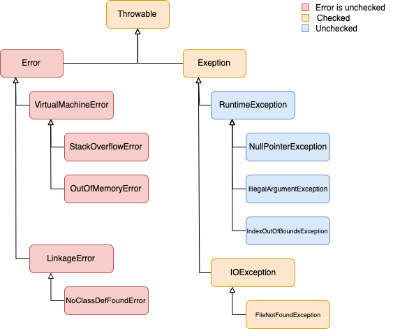

# Object-Oriented Programming

## Objectives

- OOP basics: classes and objects
- UML diagrams
- OOP basics: 
  - encapsulation, 
  - polymorphism
  - inheritance
  - composition
- Abstract classes and Interfaces
- Enums
- Exceptions
- HashMap concepts
- OOP advanced: encapsulation, coupling, cohesion, 'is-a' vs. 'has-a' relationship
- Refactoring, pair programming practice

## Main Content

### Training: OOP Basics

- https://www3.ntu.edu.sg/home/ehchua/programming/java/J3a_OOPBasics.html - read until section 2.8 (inclusive)

Discuss: classes vs. objects, state, behavior, class definition, instantiation, dot operator

### Training: UML Class Diagrams

Watch this video until 3:34:
- https://www.youtube.com/watch?v=UI6lqHOVHic

Discuss the basics of creating UML diagrams (with example on the white board).

### Training: OOP Basics

- https://personal.ntu.edu.sg/ehchua/programming/java/J3a_OOPBasics.html
  - Read the following: section 2.9 - 2.17
    2.9  Constructors
    2.10  Revisit Method Overloading
    2.11  The Access Control Modifiers: public/private
    2.12  Information Hiding and Encapsulation
    2.13  The public Getters/Setters for private Variables
    2.14  Keyword "this"
    2.15  Method toString()
    2.16  Constants (final)
    2.17  Putting Them Together in the Finalized Circle Class

- Varargs:
  - https://www.baeldung.com/java-varargs

#### Workshop - encapsulation and basic oop topics

  - Example code: `pm_01_encapsulation.ork`

    Discuss the following topics:
    
    - encapsulation/information hiding
    - method overloading (method signature)
    - public/private access modifiers
    - varargs

#### Exercise: 

- Work on the following exercises (write tests!):
  - `pm_01_encapsulation.employee`
  - `pm_01_encapsulation.customer`
  - `pm_01_encapsulation.car`  
- https://technologyconversations.com/2014/04/23/java-tutorial-through-katas-tennis-game-easy/
  - Tennis rules - https://en.wikipedia.org/wiki/Tennis#Scoring

  
1&#9602;&#9602;&#9602;&#9602;&#9602;&#9602;&#9602;&#9602;&#9602;&#9602;&#9602;&#9602;&#9602;&#9602;&#9602;&#9602;&#9602;&#9602;&#9602;&#9602;&#9602;&#9602;&#9602;&#9602;&#9602;&#9602;&#9602;&#9602;&#9602;&#9602;&#9602;&#9602;&#9602;&#9602;&#9602;&#9602;&#9602;&#9602;&#9602;2
    

### Training: Composition

https://personal.ntu.edu.sg/ehchua/programming/java/J3b_OOPInheritancePolymorphism.html
  - Read the first chapter: 1. Composition (1.1 - 1.3)  
    - discuss the topic of __composition__ (including the UML representation)

#### Workshop: 

- Example code in: Person in `pm_02_composition.person` package

### Training: Inheritance

https://personal.ntu.edu.sg/ehchua/programming/java/J3b_OOPInheritancePolymorphism.html
  - Read the second chapter: 2. Inheritance: (2.1 - 2.10)  
    - discuss the following topics:  
        - `extends` keyword  
        - `super` keyword  
        - method overriding
        - constructors
        - UML representation inheritance
        - single inheritance
        - common root class

  - Read the third chapter: 3. Composition vs. Inheritance (3.1)  
    - discuss the difference between inheritance and composition ('is-a' vs. 'has-a')

#### Workshop: inheritance

- Example code: Cars in `pm_02_inheritance.inheritance_car` package

#### Exercise: inheritance 

- HighSchool in `pm_02_inheritance.highschool` package
- FightClub in `pm_02_inheritance.fighter` package (with TDD)
- Desk in `pm_02_composition.desk` package

  
2&#9602;&#9602;&#9602;&#9602;&#9602;&#9602;&#9602;&#9602;&#9602;&#9602;&#9602;&#9602;&#9602;&#9602;&#9602;&#9602;&#9602;&#9602;&#9602;&#9602;&#9602;&#9602;&#9602;&#9602;&#9602;&#9602;&#9602;&#9602;&#9602;&#9602;&#9602;&#9602;&#9602;&#9602;&#9602;&#9602;&#9602;&#9602;&#9602;3
   

### Training: Polymorphism
https://personal.ntu.edu.sg/ehchua/programming/java/J3b_OOPInheritancePolymorphism.html

Read chapter 4 (4.1 - 4.6)  
- discuss:  
  - what is polymorphism?  
  - upcasting and downcasting  
  - instanceof operator
  - Check `abstract_classes_car`, `interface_example` and `casting_sandbox` packages for reference

#### Exercise:
- AdamEve in `pm_03_polymorphism.human` package

### Training: Abstract Classes, Interfaces and Access Modifiers

- Abstract classes & interfaces  
https://personal.ntu.edu.sg/ehchua/programming/java/J3b_OOPInheritancePolymorphism.html
  - chapters 5.1 - 5.3 - discuss the word abstract
  - chapters 5.4 - 5.10 - discuss interfaces and its advantages and disadvantages compared to abstract classes
  
- Access modifiers: public, protected, default/package private (no modifier), private:  
https://docs.oracle.com/javase/tutorial/java/javaOO/accesscontrol.html

Discuss in more details the `abstract_classes_car` and `interface_example` packages.

#### More exercises:

- Account in `pm_03_polymorphism.account` package (with TDD)
- RegularCar.md in `pm_03_polymorphism.regularcar` package

  
3&#9602;&#9602;&#9602;&#9602;&#9602;&#9602;&#9602;&#9602;&#9602;&#9602;&#9602;&#9602;&#9602;&#9602;&#9602;&#9602;&#9602;&#9602;&#9602;&#9602;&#9602;&#9602;&#9602;&#9602;&#9602;&#9602;&#9602;&#9602;&#9602;&#9602;&#9602;&#9602;&#9602;&#9602;&#9602;&#9602;&#9602;&#9602;&#9602;4
    

### Training: Enum

- Read the first half of this: https://docs.oracle.com/javase/tutorial/java/javaOO/enum.html
- Discuss the `pizza` package, and use as future reference
- Optional: read the second half of the documentation

### Exercise: Enum

1. Month.java in `pm_04_enum.month` package
2. Try to solve Month exercise with Enum property, just like the Planet exmaple in https://docs.oracle.com/javase/tutorial/java/javaOO/enum.html
3. Card.java in `pm_04_enum.card` package

### Training: Garbage collector

In other languages like C/C++, programmer is responsible for both creation and destruction of objects. Usually programmer neglects destruction of useless objects. Due to this negligence, at certain point, for creation of new objects, sufficient memory may not be available and entire program will terminate abnormally causing **OutOfMemoryErrors**.

With Java we are lucky, because this is done for us automatically by the Garbage Collector. Although this can be done manually as well, like you will see this in the `pm_04_enum.casino` exercise

Read the following article:  https://www.geeksforgeeks.org/island-of-isolation-in-java/

### Training: UML Modeling

- Complete the video (that we started to watch 2 days ago and finished at 3:34):
    https://www.youtube.com/watch?v=UI6lqHOVHic

- Optional: for more on this topic read this article:  
    https://medium.com/@smagid_allThings/uml-class-diagrams-tutorial-step-by-step-520fd83b300b

#### Workshop: Webshop Modeling

Work together with your teammates and model a simple webshop with UML.  
The webshop should have a way to save its users and their information. Each user 
should have a shopping cart, which can be filled with products. Users can buy the
items in their shopping cart, which means their cart becomes empty, however, the
order should be saved somewhere, with information about the products.  
Think through what classes you would use, what variables each class should have and
how the classes should connect to each other.

#### Workshop: Webshop Implementation

Implement the web shop model from the previous workshop.

#### Exercise: Casino

- Casino.md in the `pm_04_enum.casino` package (pair programming)
  - model the exercise
  - implement the exercise

### Hands-On: SonarLint Setup

 1. file -> settings -> plugins -> marketplace -> search: sonarlint -> install
 2. restart idea

The SonarLint tab appears on the bottom of the page, near Terminal and Version Control

Disable Rules:
 1. file -> settings -> other settings -> sonarlint general settings
 2. Rules -> Search and disable:
     - "Track uses of TODO tags"
     - "Standard outputs should not be used …"

To run an analysis, click on the src folder and hit CTRL+SHIFT+S (CMD+SHIFT+S)

  
4&#9602;&#9602;&#9602;&#9602;&#9602;&#9602;&#9602;&#9602;&#9602;&#9602;&#9602;&#9602;&#9602;&#9602;&#9602;&#9602;&#9602;&#9602;&#9602;&#9602;&#9602;&#9602;&#9602;&#9602;&#9602;&#9602;&#9602;&#9602;&#9602;&#9602;&#9602;&#9602;&#9602;&#9602;&#9602;&#9602;&#9602;&#9602;&#9602;5

  

### Workshop: Exception Handling

#### General idea of exception handling

If you run an application you can encounter errors or exceptional cases which can crash your program. One of your task 
as a developer is to write the code in a way that can handle these kind of issues. In Java (and in most OOP languages)
we call these issues exceptions.

Object-oriented languages produce an object from the exception. When a method detects a problem, it creates an instance
of an exception class, than throw that instance with the `throw` keyword to signal the error. The exception is not the 
same as the return value that can be returned with the `return` keyword. When en exception is thrown, the execution of 
the current method is interrupted and the control goes back to the caller.  
If the call was surrounded with a `try-catch` block, the exception is caught and a matching `catch` block will be 
executed. If there was no surrounding `try-catch` block in the direct caller, the caller is also interrupted and throws 
the exception to its caller. The process continues upwards in the call stack until one of the callers catches 
the exception.  
If no method catches the exception and it reaches `main()`, the application is terminated and we see the exception and 
the stack trace in the console.

#### What is an exception?

Exceptions are objects, instances of exception classes. There are some exception classes in the class library but it is 
possible to write own exception classes as well. The class of the exception itself describes what kind of problem arose 
but just like regular objects, exceptions can carry further information in their instance variables.  
For example `IllegalArgumentException` indicates that one of the arguments passed to the method are illegal. In case you
want to implement a method to calculate the square root of real (but not complex) numbers you can throw an instance of 
`IllegalArgumentException` if a negative value is passed to the method, since negative numbers do not have real 
square roots.

#### Class hierarchy of exceptions

Just like every class is (either directly or indirectly) a subclass of `Object`, every exceptions are subclasses of 
`Throwable`. It is the common supertype of objects that can be thrown and caught.

`Error` is a subclass of `Throwable`, which indicates an unforeseen events that the application cannot recover
from, such as running out of memory. Consequently, there is really no point in catching errors. Error classes 
conventionally end with the Error suffix, such as `OutOfMemoryError`.

`Exception` is the common superclass of exceptions. Unlike errors, exceptions warrant error handling and should be 
caught. Some of them can be foreseen, such as I/O exceptions when we work with files. There is the `IOException`
class to signal such problems. Exception classes conventionally end with the Exception suffix.  
For instances of Exception, methods that may throw the exception, must declare that after the parameter list with 
the `throws` keyword. 

There is an important subclass of `Exception`, called `RuntimeException`. The difference is that instances of 
`RuntimeException` are not required to be declared after the method's parameter list. Therefore, these exceptions are 
also called *unchecked exceptions*, whereas those that are instances of `Exception` but not `RuntimeException` are
called *checked exceptions*. 

Unchecked exceptions are usually better to use. In most cases, we can assure that we use a specific method in a way 
that it will not throw an exception so adding a `try-catch` block would be unnecessary and would just make the code 
longer and harder to read. In such cases, it is better to design the method in such a way that it signal errors with
 *unchecked exceptions*.
 
 

#### Workshop: Exceptions

Work in `pm_05_exception.demo` package:

- `exceptioncatching`
    - what is an exception
    - how can you catch it
    - what happens if you don't
- `exceptionthrowing`
    - how can you throw an exception
    - and when should you
    - creating custom runtime exceptions
- `finallyblock`
- `multicatch`
    - catching multiple types of exceptions
    - the importance of ordering catch blocks
    - multicatch syntax

#### Exercise: Exceptions

- `pm_05_exception.exercises` package:
  - exception(1-4) packages
  - Play with the code a little bit  in this exercise: `pm_05_exception.exercises.sandbox`

#### Workshop: Checked and unchecked exceptions

Work in `pm_05_exception.demo.checked_and_unchecked` package.

- what is the difference of the two exception types
- when to use which one
- when are checked exceptions thrown

#### Refresh: Exceptions

 - Video - https://www.youtube.com/watch?v=ohpCMpderow

### Hands-On: Kutya

- Kutya workshop demonstrating polymorphism, inheritance, interfaces, static and object variables etc.

  
5&#9602;&#9602;&#9602;&#9602;&#9602;&#9602;&#9602;&#9602;&#9602;&#9602;&#9602;&#9602;&#9602;&#9602;&#9602;&#9602;&#9602;&#9602;&#9602;&#9602;&#9602;&#9602;&#9602;&#9602;&#9602;&#9602;&#9602;&#9602;&#9602;&#9602;&#9602;&#9602;&#9602;&#9602;&#9602;&#9602;&#9602;&#9602;&#9602;6
  

### Training: Map

Read the lesson: https://www.javatpoint.com/working-of-hashmap-in-java

Discuss how maps work in java! 

- Optional:
    - How to use HashMap? https://www.youtube.com/watch?v=J-klDVEtwkM
    - How Hashmap works? (with animation): https://youtu.be/c3RVW3KGIIE?t=206
    

#### Exercise: Map

Do exercise in `pm_06_map_coupling_cohesion.map` package: CountNumbers.java

### Training: Encapsulation, Coupling & Cohesion

Read again Chapter 6.: https://personal.ntu.edu.sg/ehchua/programming/java/J3b_OOPInheritancePolymorphism.html#zz-6.1

Loose coupling - http://stackoverflow.com/questions/226977/what-is-loose-coupling-please-provide-examples  

### Exercise: Shopping list

- `pm_06_map_coupling_cohesion.shoppinglist` package

### Exercise: Farm

- `pm_06_map_coupling_cohesion.farm` package

### Exercise: Fleet

- `pm_06_map_coupling_cohesion.fleet` package

### Exercise (~1h):

 1) Design and draw a 4-5 class/interface UML model by your own ideas.
 You can use sketchboard.io, draw.io or paper to draw UML and send the screenshot/photo to Slack Random channel. (~15min)

 2) Workshop: discuss together the results (max 45min)

6▂▂▂▂▂▂▂▂▂▂▂▂▂▂▂▂▂▂▂▂▂▂▂▂▂▂▂▂▂▂▂▂▂▂▂▂▂▂▂7

### Exercise: Video store (UML model, Pair-programming)

- see videostore package under src folder
- work in pairs

See also:
   http://www.inf.ed.ac.uk/teaching/courses/inf1/op/Labs/2008/doc/lab2.html

## Material Review

- classes, instances, dot operator, this keyword
- member variables, member methods
- static methods
- constructors
- constructor overloading
- method overloading
- encapsulation, getters and setters
- toString method
- composition
- inheritance, super keyword
- construction chaining
- composition vs inheritance (is-a, has-a)
- enum basics
- instanceof operator
- mention of abstract class
- polymorphism, upcasting/downcasting
- abstract classes
- interface vs abstract class (java 8 updates)
- access control modifiers (private, public, protected)
- basic exception handling
  - keywords - try, catch, finally, throw, throws
  - common exception classes
  - creating own exceptions
  - checked vs unchecked exceptions
  - finally exception hidings
- equals method
- HashMap 
  - key-value
  - entry
  - put, get, replace, contains, remove
  - entrySet
- Random, seed
- OOP: encapsulation, coupling, cohesion
- is-a, has-a relationship
- add dependency to project
- JUnit @Before, @After

## See also

- UML rules - https://my.pcloud.com/publink/show?code=XZR1rgZaWo8o08b2FY1cU2FBnbiIVdvRz7k
- Head First Design Patterns (Optional) - https://my.pcloud.com/publink/show?code=XZwOjPZ2OC3eH7UprzgYBUmOedHnRTDFUx7
- Unit test naming conventions: https://dzone.com/articles/7-popular-unit-test-naming
- SOLID: https://en.wikipedia.org/wiki/SOLID_(object-oriented_design)
- OCP: http://joelabrahamsson.com/a-simple-example-of-the-openclosed-principle/
- abstraction level: https://softwareengineering.stackexchange.com/questions/110933/how-to-determine-the-levels-of-abstraction
- junit annotations - https://www.mkyong.com/unittest/junit-4-tutorial-1-basic-usage/
- why encapsulation matters? - https://dzone.com/articles/why-encapsulation-matters
- floating point arithmetic - https://stackoverflow.com/questions/1661273/floating-point-arithmetic-not-producing-exact-results
- pass-by-value vs pass-by-reference - https://www.youtube.com/watch?v=q-DuzRHWCj4&t=147s
- How to choose the right java collection? - https://javatutorial.net/choose-the-right-java-collection
- HashSet/HashMap Demo - https://www.youtube.com/watch?v=jwtx6GVPdyw - 13:24
- Effective Java by Joshua Block - http://bit.ly/pm-effecte-java-pdf
## Homework

- Every day: feedback form
  - https://docs.google.com/forms/d/1_wxtB2BXI_cks7tGM6Ea1A8_HNkdwciNbBjAdNGIOC8/viewform?edit_requested=true

- Clean code - Chapter 4-10:
  - magyarul (rar): https://my.pcloud.com/publink/show?code=XZxDTT7Zwku1F5o7xT81wrz0zb24l8KBxbnk
  - angolul: https://my.pcloud.com/publink/show?code=XZazDgZMeElEnsEOby5RIyNwXbwqkTFwd7X

- OOP lectures on Udemy - Tim Buchalka's Java Programming Masterclass for Software Developers:
    https://www.udemy.com/java-the-complete-java-developer-course/learn/v4/overview
  - Section 9 - Inner and Abstract Classes & Interfaces

## License 

Copyright © PROGmasters (QTC Kft.), 2016-2019.
All rights reserved. No part or the whole of this Teaching Material (TM) may be reproduced, copied, distributed, publicly performed, disseminated to the public, adapted or transmitted in any form or by any means, including photocopying, recording, or other electronic or mechanical methods, without the prior written permission of QTC Kft. This TM may only be used for the purposes of teaching exclusively by QTC Kft. and studying exclusively by QTC Kft.’s students and for no other purposes by any parties other than QTC Kft.
This TM shall be kept confidential and shall not be made public or made available or disclosed to any unauthorized person.
Any dispute or claim arising out of the breach of these provisions shall be governed by and construed in accordance with the laws of Hungary.
